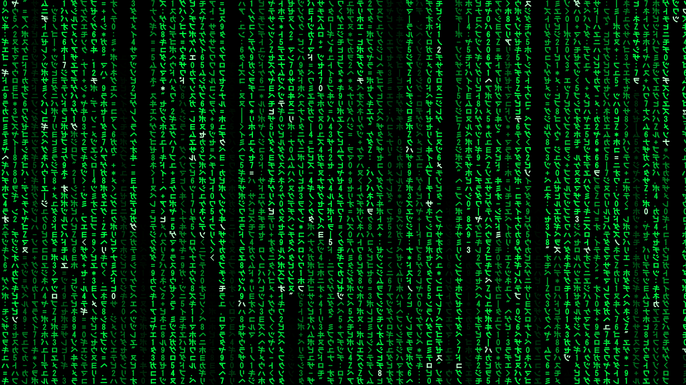
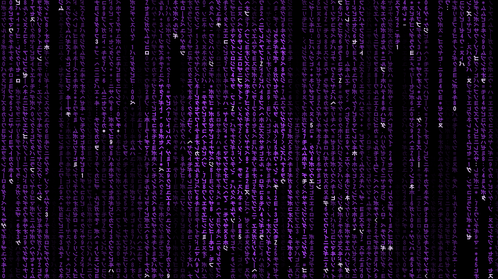
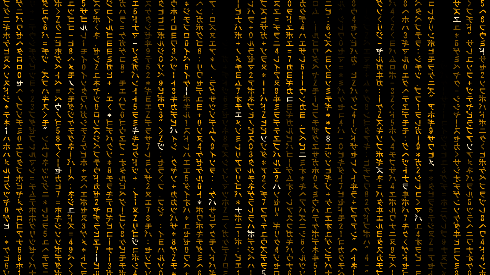

# Matrix Screensaver

A fast, highly configurable "digital rain" screensaver for Windows 10 and 11, with multi-monitor support
and an optional hidden image that slowly emerges from the falling code.



## Features

- **Film-style rain.** Mirrored katakana, digits and symbols with a bright leading character, fading
  trails and shimmering glyphs.
- **Highly configurable.** Color (presets, custom color, or rainbow), speed, character size, width and
  stroke weight, column spacing, density and trail duration.
- **Hidden image.** A picture fades in and out of the rain, visible only if you stare. Choose a
  built-in image (the 1730 silhouette, a skull, an alien or the Triple Zero mark), your own image, or a
  random image from a folder.
- **CRT scanlines** for an old-TV look.
- **Multi-monitor.** Independent rain on every monitor, or only on the primary one.
- **Sharp on every display.** Per-monitor DPI aware, so mixed 1080p, 1440p and 4K setups all render at
  native resolution.
- **Lightweight.** About 1–2 ms per 4K frame, and a single `.scr` file with no runtime to install —
  the WPF theme used by the settings window is embedded in it.

| Hidden image: the 1730 silhouette at 40% strength | Amber with CRT scanlines |
|---|---|
|  |  |

## Install

1. Download `MatrixScreensaverSetup-<version>.exe` from the [Releases](../../releases) page.
2. Run it. Windows SmartScreen may warn about an unrecognized app because the installer is not code
   signed. Choose **More info → Run anyway**.
3. Optionally tick **Make Matrix my screen saver**.

The installer places `Matrix.scr` in `C:\Windows\System32` so it always appears in Windows'
**Screen Saver Settings**. It also adds Start menu shortcuts for the settings and a preview. Uninstall
from **Settings → Apps**.

**Without the installer:** download `Matrix.scr`, right-click it and choose **Install**. You can also
copy it to `C:\Windows\System32` yourself (requires admin).

**Requirements:** Windows 10 version 1903 or later (including Windows 11), x64 or Arm64. It uses the
.NET Framework 4.8, which is built into these versions of Windows.

## Usage

Open the settings in any of these ways:

- Start menu → **Matrix Screensaver Settings**
- Windows **Screen Saver Settings** → select *Matrix* → **Settings…**
- Right-click `Matrix.scr` → **Configure**

The settings window has a live preview. **Test full screen** runs the screensaver on all monitors with
your unsaved settings; move the mouse or press a key to return.

| Setting | What it does |
|---|---|
| Color / Rainbow | Rain color, or a different hue per column |
| Speed | How fast the drops fall |
| Character size | Glyph height in pixels at 100% display scaling (scaled per monitor) |
| Character width | Horizontal stretch of each glyph |
| Column spacing | Gap between columns, as a percentage of the character size |
| Stroke weight | Thickens character outlines (0 = the font's natural weight) |
| Density | How many drops fall at once |
| Trail duration | How long each character stays visible after the leading character passes |
| Bright white leading character | Highlights the head of each drop |
| CRT scanlines / strength | Darkened horizontal lines across the characters |
| Hidden image / strength | Turns the effect on, and how visible it is |
| Image | Which picture to reveal: **1730** (default), **Skull**, **Alien**, **Triple Zero**, or **Custom…** (your own file, or a folder to pick from at random) |
| Show rain on all monitors | Otherwise only the primary monitor shows rain and the others go black |

Settings are stored per user in `HKCU\Software\MatrixScreensaver`.

**Tips for hidden images:** high-contrast pictures with a bright subject on a dark background work
best. Each character acts as one "pixel", so fine detail is lost. Bold shapes and dark holes come
through well; thin outlines (like the Triple Zero mark) need a higher strength to read.

The built-in images are drawn by [`tools/generate-assets.py`](tools/generate-assets.py) and embedded
in the executable.

### Command line

`Matrix.scr` follows the standard Windows screensaver conventions:

| Argument | Mode |
|---|---|
| `/s` | Run full screen |
| `/c` or no argument | Settings dialog |
| `/p <hwnd>` | Preview inside the given window (used by Screen Saver Settings) |

## Building from source

You need the [.NET SDK](https://dotnet.microsoft.com/download) (8 or later) on Windows. It is only
used to build; the output targets .NET Framework 4.8.

```powershell
.\build.ps1              # builds dist\Matrix.scr
.\build.ps1 -Installer   # also builds dist\MatrixScreensaverSetup-<version>.exe
```

Building the installer also needs [Inno Setup 6](https://jrsoftware.org/isinfo.php)
(`winget install JRSoftware.InnoSetup`). The version number comes from `<Version>` in
[`MatrixScreensaver.csproj`](MatrixScreensaver.csproj).

See [CONTRIBUTING.md](CONTRIBUTING.md) for how the code is organized and how to test changes, and
[docs/ARCHITECTURE.md](docs/ARCHITECTURE.md) for how the renderer works.

## Troubleshooting

- **Characters show as Latin letters instead of katakana.** No installed font has Japanese katakana.
  Add the *Japanese Supplemental Fonts* optional feature (Settings → System → Optional features).
- **The screensaver isn't in the Screen Saver Settings list.** It must be in `C:\Windows\System32`.
  Use the installer, or copy `Matrix.scr` there manually.
- **The hidden image never appears.** Make sure *Hidden image* is ticked. The first reveal starts a few
  seconds after the screensaver starts, and each image fades in over about 10 seconds.
- **SmartScreen warning.** The installer and `.scr` are not code signed. Builds from this repository's
  source are safe to run; verify the release checksum if in doubt.

## Third-party components

The settings window is styled with [TripleZeroLabs.Os2](https://www.nuget.org/packages/TripleZeroLabs.Os2),
a WPF theme by Triple Zero Labs, LLC (MIT + Commons Clause). It is embedded in `Matrix.scr` at build
time. See [THIRD-PARTY-NOTICES.md](THIRD-PARTY-NOTICES.md).

## Contributing

Bug reports, ideas and pull requests are welcome. Please read [CONTRIBUTING.md](CONTRIBUTING.md) and
the [Code of Conduct](CODE_OF_CONDUCT.md). To report a security issue, see [SECURITY.md](SECURITY.md).

## License

[MIT](LICENSE)

## Disclaimer

This is an independent fan project inspired by the "digital rain" effect from *The Matrix*. It is not
affiliated with, endorsed by, or sponsored by Warner Bros. Entertainment Inc. or the film's creators.
*The Matrix* is a trademark of its respective owner. The project contains no footage, images, fonts or
other material from the films.
